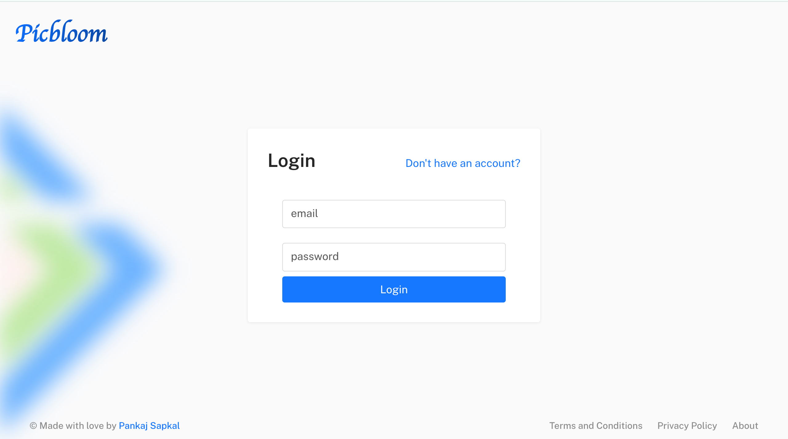
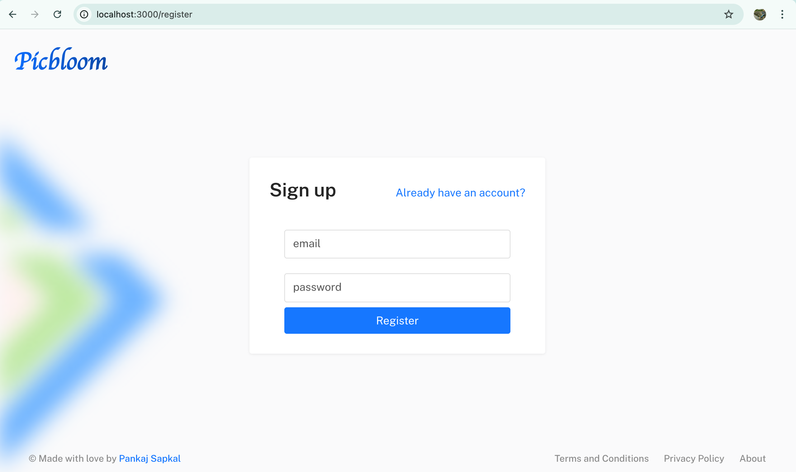
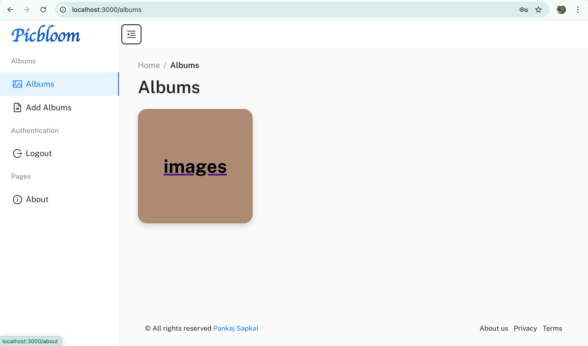
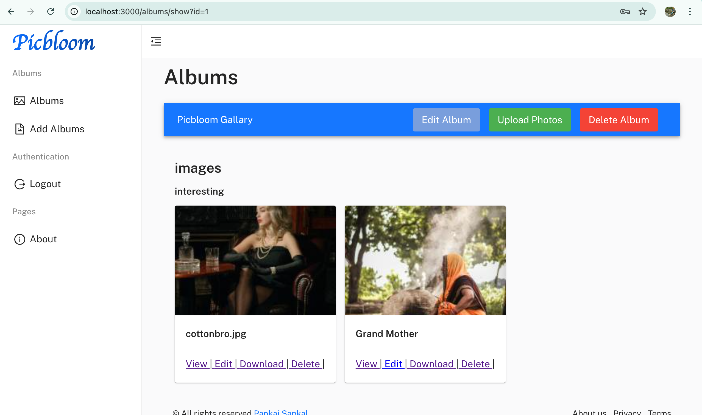
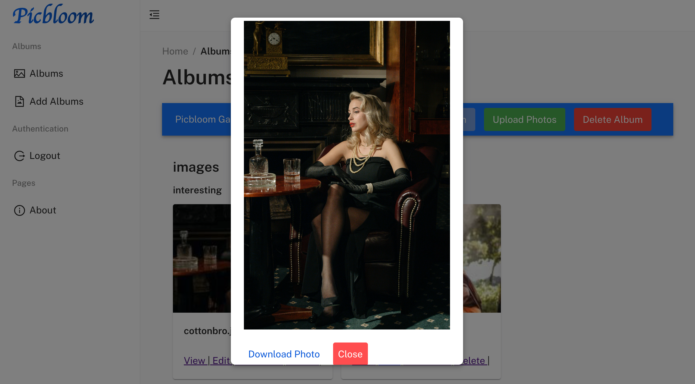
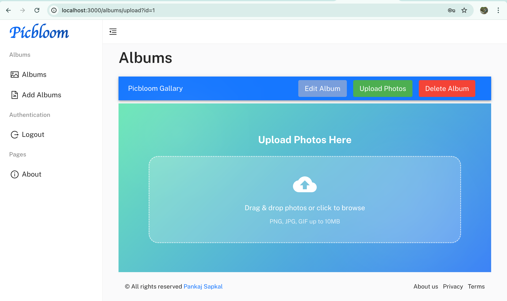
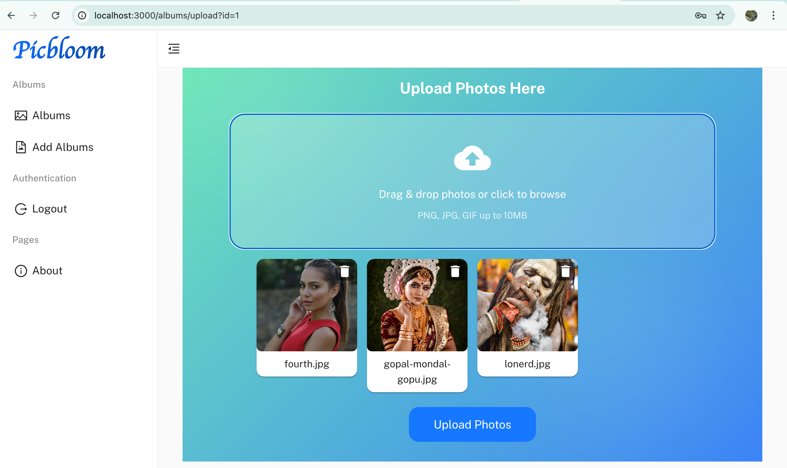
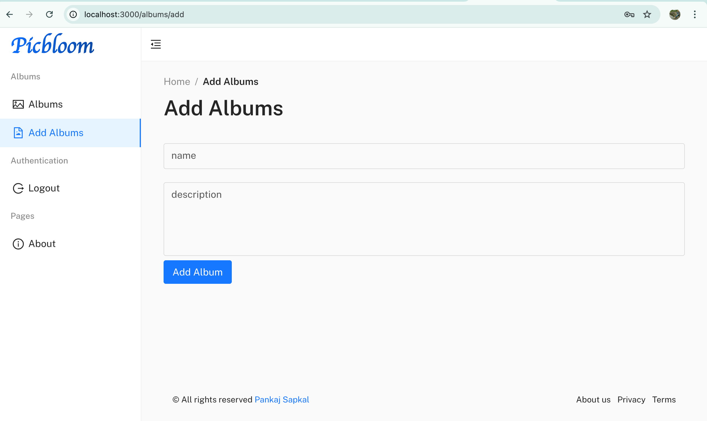
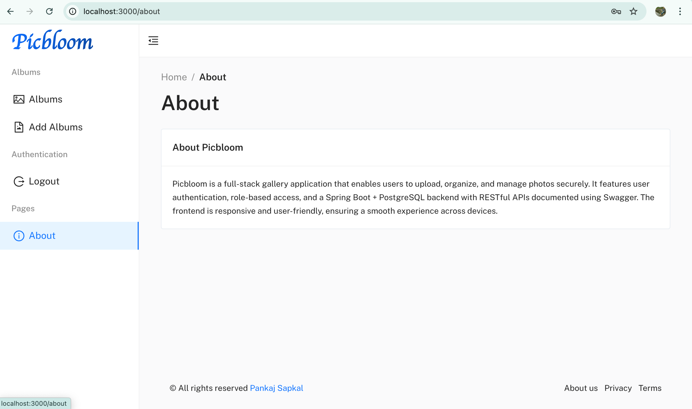

# Picbloom

Picbloom is a modern, responsive, and user-friendly **photo gallery and album management system**. Users can register, login, create albums, upload photos, and manage them efficiently.

---

## Features

- User registration and login  
- Create, edit, and delete albums  
- Upload, edit, and delete photos  
- Responsive Material UI design  
- State management with React Context API  
- Client-server communication using Axios  
- Backend powered by **Java, Spring Boot, PostgreSQL**  

---

## Tech Stack

- **Frontend:** React, Material UI, Vite  
- **State Management:** React Context API  
- **Routing:** React Router DOM  
- **HTTP Client:** Axios  
- **Backend:** Java, Spring Boot, PostgreSQL  

---

## Screenshots

Below are some screenshots of Picbloom in action:

  
  
  
  
  
  
  
  
  

---

## Folder Structure

```
frontend/
│
├── src/                   # Source code
│   ├── api/               # API client functions
│   ├── assets/            # Images, fonts, icons
│   ├── components/        # Reusable UI components
│   ├── contexts/          # React Context API for state management
│   ├── hooks/             # Custom React hooks
│   ├── layout/            # Layout components (Header, Footer, Sidebar)
│   ├── pages/             # Application pages
│   ├── routes/            # Route definitions
│   └── utils/             # Utility functions
│
├── public/                # Public assets
├── package.json
├── vite.config.mjs
└── README.md
```

---

## License

This project is licensed under the MIT License. See [LICENSE](./LICENSE) for details.

---

## Author

**Pankaj Sapkal**
